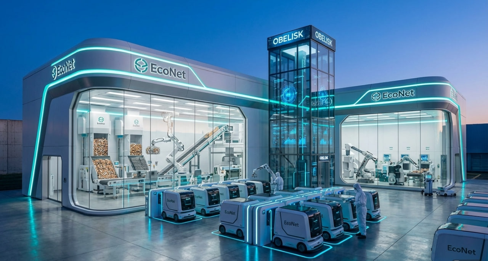

# EcoNet — Autonomous Swarm Robotics for Urban Cleanup & Recycling

> Автономная система роевой робототехники: детекция, сбор, очистка, дробление и прессование окурков в теплоизоляционные строительные материалы.  
> Solo-разработка: 30 000+ строк кода, 141 файл, полная GPU-оптимизация.

**Статус:** ✅ Полностью функционален | **Версия:** 1.2 | **Обновлено:** 2026-03-17

---

<p align="center">
  
</p>

<p align="center"><b>DETECT → COLLECT → RECYCLE → PRODUCT</b></p>

---

## Ключевые метрики

| Метрика | Значение |
|---|---|
| YOLO Inference | **10.3 ms / frame** (97 FPS) |
| GPU Precision | **FP16** (Tensor Cores) |
| cuDNN Benchmark | **ON** (auto-tuned convolutions) |
| TF32 (Ampere) | **ON** |
| Датасет | 9 399 изображений (train/val/test) |
| Нейронная архитектура | 4 нейрона, 9 связей |
| Swarm узлы | 4 (full_mesh topology) |
| Компоненты | 10/10 инициализированы |

---

## Что это

**EcoNet** — не просто робот-уборщик. Это **замкнутый производственный цикл**, превращающий городской мусор в строительные материалы.

<p align="center">
  
</p>

### Полный цикл переработки (Circular Economy)

```
          Окурки (мусор, 0₽)
                │
    ┌───────────┼───────────┐
    ▼           ▼           ▼
┌────────┐ ┌────────┐ ┌──────────────┐
│ Табак  │ │Ацетат- │ │ Бумага,      │
│+ смолы │ │целлюл. │ │ загрязнения  │
└───┬────┘ └───┬────┘ └──────┬───────┘
    │          │             │
    ▼          ▼             ▼
 Биогаз    Дробление     Очистка
    │      Прессование   Фильтрация
    │          │
    ▼          ▼
⚡ Энергия   🧱 Строительные
для роя      материалы:
    +         • Теплоизоляционные плиты
☀️ Солнечные  • Тротуарная плитка
   панели    • Садовые лавки
              • Цветочные подставки
```

**Результат:** система, которая **сама себя питает** — роботы собирают "топливо" для собственной подзарядки, а побочный продукт имеет рыночную стоимость.

### Что внутри

| Компонент | Назначение |
|---|---|
| **YOLOv8** | Real-time детекция окурков с FP16 на GPU (97 FPS) |
| **Нейронная архитектура** | 4 взаимосвязанных нейрона (YOLO, DeepSeek LLM, Coordinator, Information Hub) |
| **SwarmOS** | Децентрализованная координация роя через поле эффективности |
| **GPU Veins** | Система "кровообращения" GPU: мониторинг, распределение VRAM |
| **DeepSeek LLM** | Интегрированный чат через Ollama (deepseek-r1:8b) |
| **Active Learning** | Автоматическое улучшение модели на новых данных |
| **Obelisk** | Мобильная база — транспорт, переработка, зарядка роботов |

<p align="center">
  
</p>

---

## Как это работает

### Фаза 1: Детекция и сбор

Рой мини-роботов с камерами патрулирует территорию. YOLOv8 детектирует окурки в реальном времени. Дрон-разведчик координирует сверху. SwarmOS распределяет зоны через поле эффективности — нет центра, нет единой точки отказа.

### Фаза 2: Переработка

Obelisk — мобильная база. Роботы возвращаются, сдают собранное. Внутри:
1. **Очистка** — удаление никотина, смол, загрязнений
2. **Разделение** — табак отдельно, ацетатцеллюлоза отдельно
3. **Дробление** — ацетатцеллюлоза измельчается
4. **Прессование** — формирование плит

### Фаза 3: Продукт

Выход: теплоизоляционные плиты для строительства. Ацетатцеллюлоза — реальный термоизолятор. Побочный биогаз идёт на подзарядку роя. Солнечные панели на крыше Obelisk дополняют энергобаланс.

<p align="center">
  
</p>

---

## Быстрый старт

```bash
# Установка зависимостей
pip install -r requirements.txt

# Запуск GUI
python scripts/run_gui.py

# Или полная система (API + GUI)
python scripts/start_econet_system.py
```

**Требования:** Python 3.8+, NVIDIA GPU с CUDA (RTX рекомендуется), 8+ GB RAM

---

## Архитектура

```
EcoNet/
├── obelisk/                    # Центральный мозг системы
│   ├── core/
│   │   ├── engines/
│   │   │   ├── unified_engine.py    # Главный движок (координация всех систем)
│   │   │   └── model_engine.py      # YOLO: FP16, cuDNN, GPU warmup
│   │   ├── managers/
│   │   │   └── gpu_manager.py       # GPU: memory, cuDNN benchmark, TF32
│   │   ├── neural_nodes.py          # 4 нейрона + архитектура связей
│   │   └── neural_sync.py           # Синхронизация компонентов
│   ├── veins/                       # GPU кровообращение
│   │   ├── gpu_circulatory.py       # Распределение GPU ресурсов
│   │   ├── gpu_monitor.py           # Мониторинг VRAM, температуры
│   │   ├── gpu_scheduler.py         # Планировщик GPU задач
│   │   └── gpu_distributor.py       # Умное распределение между задачами
│   ├── swarm/                       # SwarmOS — полевая архитектура роя
│   │   ├── field_node.py            # Узел: вектор состояния (E, R, C, B, T, Φ)
│   │   ├── efficiency_field.py      # Диффузия поля эффективности
│   │   ├── swarm_kernel.py          # Ядро ОС роя (async loop)
│   │   ├── field_scheduler.py       # Градиентная миграция задач
│   │   └── field_communication.py   # MQTT ↔ поле
│   ├── services/                    # Сервисы
│   │   ├── llm_integration.py       # LLM: Ollama, Groq, Gemini, HuggingFace
│   │   ├── active_learner.py        # Active Learning pipeline
│   │   ├── mqtt_client.py           # MQTT коммуникация
│   │   ├── self_identity.py         # Самоидентификация
│   │   ├── self_modification.py     # Самомодификация
│   │   └── database.py              # SQLite / PostgreSQL
│   ├── api/                         # FastAPI REST API
│   └── ui/
│       ├── gui_material.py          # Material Design GUI
│       └── video_display_simple.py  # Видео pipeline (camera/file/stream)
├── edge/                            # Edge inference (Jetson, RPi)
├── robots/                          # Роботы-сборщики
├── models/                          # YOLO веса (.pt)
├── datasets/                        # Датасет окурков (9399 изображений)
├── config/config.yaml               # Единый конфиг системы
└── tests/                           # Unit + integration тесты
```

---

## GPU-оптимизации (v1.2)

EcoNet выжимает максимум из NVIDIA GPU:

| Оптимизация | Эффект |
|---|---|
| **FP16 (half precision)** | Tensor Cores RTX, 2x меньше VRAM |
| **cuDNN benchmark** | Авто-подбор быстрейшего алгоритма конволюций |
| **TF32 (Ampere)** | Ускорение matmul на RTX 30xx/40xx |
| **GPU warmup** | Прогрев при загрузке — без "холодного" первого кадра |
| **Zero GPU sync в hot path** | `torch.cuda.synchronize()` убран из inference loop |
| **Frame-dropping** | Пропуск кадров при перегрузке GUI |
| **Inference guard** | Один YOLO inference за раз (без очереди) |
| **CUDA expandable segments** | Меньше фрагментация памяти |
| **GPU Veins** | Мониторинг + распределение VRAM между задачами |

**Бенчмарк (RTX 3070 Laptop, 8 GB VRAM):**
```
FP16: 10.3 ms/frame → 97 FPS
VRAM: 0.04 GB (модель YOLOv8n)
Доступно для других задач: 7.96 GB
```

---

## Нейронная архитектура

4 нейрона, связанных через Information Hub:

```
┌─────────────┐     ┌──────────────────┐     ┌───────────────────┐
│ YOLO Neuron │◄───►│ Information Hub   │◄───►│ DeepSeek Neuron   │
│ (детекция)  │     │ (синхронизация)   │     │ (LLM анализ)      │
└──────┬──────┘     └────────┬─────────┘     └───────────────────┘
       │                     │
       │            ┌────────┴─────────┐
       └───────────►│ Coordinator      │
                    │ (задачи + роботы)│
                    └──────────────────┘
```

- **YOLO** → детектирует объекты → отправляет в Hub
- **DeepSeek** → анализирует контекст через LLM (Ollama)
- **Coordinator** → распределяет задачи роботам
- **Hub** → синхронизирует данные между всеми нейронами

---

## SwarmOS — полевая архитектура роя

Децентрализованная координация через физическую модель полей:

```
Эффективность:       E_i = αR_i + βC_i + γB_i
Диффузия:            E_i(t+1) = E_i(t) + D·Σ(E_j − E_i) + S_i − λ·E_i
Потенциал нагрузки:  Φ_i = T_i − R_i
Поток задач:         J_ij = −k·(Φ_j − Φ_i)
```

- Нет единой точки отказа
- Задачи мигрируют к узлам с max(E) и min(Φ)
- Масштабируется до тысяч узлов: O(N·k) на тик
- Фазовые переходы: slow_exploration → self_organization → rapid_convergence

---

## Стек технологий

| Категория | Технологии |
|---|---|
| **Computer Vision** | YOLOv8, OpenCV, FP16, Tensor Cores |
| **Deep Learning** | PyTorch, CUDA, cuDNN, TF32 |
| **LLM** | DeepSeek (Ollama), Groq, Gemini |
| **Backend** | FastAPI, asyncio, MQTT (paho-mqtt) |
| **Database** | SQLite, PostgreSQL |
| **GUI** | CustomTkinter, Material Design |
| **DevOps** | GitHub Actions CI, pytest |
| **Робототехника** | MQTT координация, SwarmOS |
| **Переработка** | Очистка, дробление, прессование ацетатцеллюлозы |

---

## Потенциал платформы

Архитектура EcoNet универсальна. Ядро (SwarmOS, GPU pipeline, нейроархитектура) адаптируется под разные задачи:

| Применение | Вход | Выход |
|---|---|---|
| **Уборка города** | Окурки, мусор | Стройматериалы |
| **Гуманитарное разминирование** | Минное поле | Карта мин + маркировка |
| **Агротехника** | Поля, посевы | Карта вредителей, урожай |
| **Инспекция** | Инфраструктура | Карта дефектов |

---

## Конфигурация

Единый файл `config/config.yaml`:

```yaml
model_engine:
  device: cuda:0
  half_precision: true      # FP16 Tensor Cores
  cudnn_benchmark: true     # Auto-tuned convolutions
  tf32: true                # Ampere matmul acceleration

swarm_field:
  enabled: true
  diffusion_coeff: 0.1     # D — скорость диффузии
  topology: full_mesh       # full_mesh | ring

chat:
  enabled: true
  llm_provider: ollama
  llm_model: deepseek-r1:8b
```

---

## Документация

| Документ | Описание |
|---|---|
| [MAIN_DOCUMENTATION.md](MAIN_DOCUMENTATION.md) | Главный навигационный файл |
| [docs/ARCHITECTURE.md](docs/ARCHITECTURE.md) | Техническая архитектура |
| [docs/NEURAL_ARCHITECTURE_4_NODES.md](docs/NEURAL_ARCHITECTURE_4_NODES.md) | Нейронная архитектура |
| [docs/UNIFIED_ENGINE_GUIDE.md](docs/UNIFIED_ENGINE_GUIDE.md) | UnifiedEngine |
| [docs/MODEL_ENGINE_GUIDE.md](docs/MODEL_ENGINE_GUIDE.md) | ModelEngine + ансамбль |
| [docs/ACTIVE_LEARNING_GUIDE.md](docs/ACTIVE_LEARNING_GUIDE.md) | Active Learning |
| [docs/SELF_AWARENESS.md](docs/SELF_AWARENESS.md) | Система самоосознания |

---

## API

```
GET  /health                    — Health check
GET  /system/status             — Статус всех компонентов
GET  /system/swarm/field        — Статус SwarmOS (энергия, фаза)
GET  /system/swarm/nodes        — Состояние узлов поля
POST /detection/frame           — Детекция на кадре
GET  /system/deepseek/status    — Статус DeepSeek нейрона
```

Swagger UI: `http://localhost:8000/docs`

---

## Тестирование

```bash
# Unit тесты
pytest tests/unit/ -v

# Все тесты
pytest tests/ -v
```

15 тестов, 100% pass rate.

---

## Лицензия

MIT License

## Автор

**Андреев Никита** — solo developer  
Telegram: [@Project_EcoNet](https://t.me/Project_EcoNet) (дневник разработки)  
GitHub: [github.com/elavist/EcoNet](https://github.com/elavist/EcoNet)
